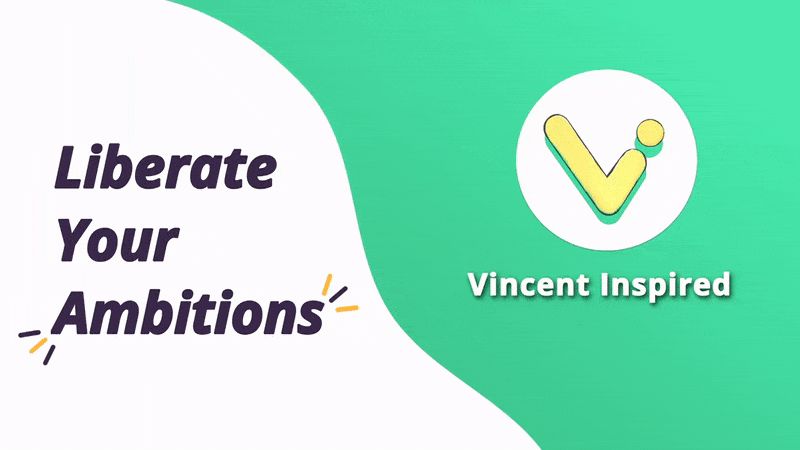

# Welcome, techie ! 

<div align="center">
    
</div>

---

##  About Me

```go
package aboutme

import _ "doingmybest"

func main() {
    v := Dev{
        Name: "Vincent Martinez",
        Lang: []Code{ Go, Java, Python, PHP, SQL, Javascript, HTML, CSS },
        Tools: []Tech{ Oracle DBMS, Postgres, MySQL, Django, SASS, gcloud },
        IsAlive: true,
    }

    v.OpenToJobs()
    v.Mentor()

    for v.IsAlive {
        v.DrinkCoffee(BLACK)
        v.Code()
        v.IsAlive = CheckPulse() // Fingers Crossed
    }
}
```

##  Philosophy

I'm passionate about creating software that inspires people to realize their vision and promotes the success of their goals. Everyone has a vision of the world that is better than it is now. I dedicate my career to building programs that aid ambitious people to act toward that vision.

##  Recent Projects

##  Latest Blog Posts
